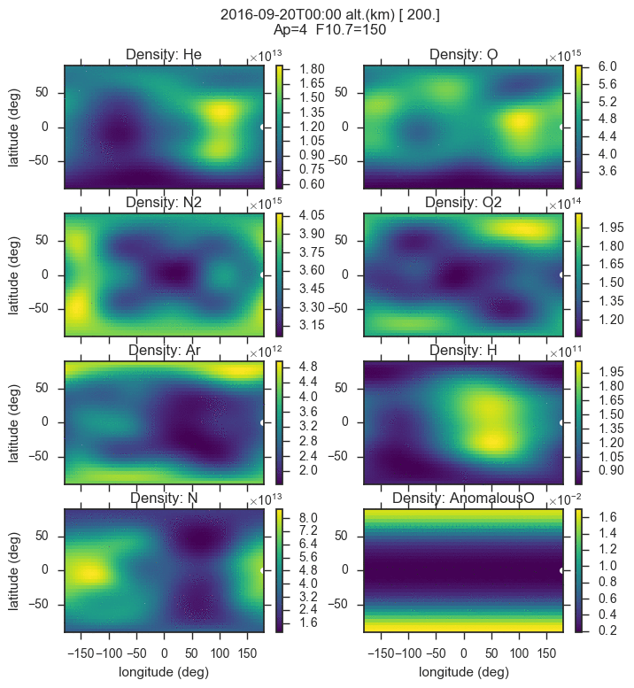
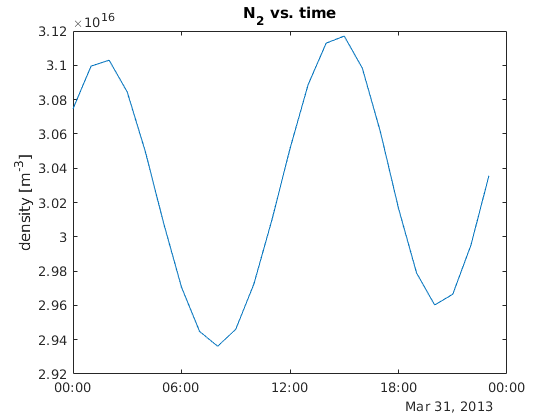

# MSISE-00 in Python and Matlab

[](https://zenodo.org/badge/latestdoi/32971905)
[](https://lgtm.com/projects/g/space-physics/msise00/context:python)


[](https://pypi.python.org/pypi/msise00)
[](http://pepy.tech/project/msise00)

NRL MSISE-00 atmospheric model for Python &ge; 3.6, also accessible via Matlab or GNU Octave.
Valid from altitude z = 0..1000 km.

The plot immediately below shows a slice at 200km on a world-wide grid.
The yellow ball represents the sun footprint on Earth.



This plot is from [Matlab](./msise00/tests/test_msise00_matlab.m) calling MSISE00:



## Install

This process is used for the Python and [Matlab](#matlab) access to MSIS.
Any Fortran compiler should work.
Fortran compiler may be installed by

* MacOS / Homebrew: `brew install gcc`
* Linux: `apt install gfortran`
* [Windows](https://www.scivision.dev/windows-gcc-gfortran-cmake-make-install/)

Get MSISE00 and install Python package:

```sh
pip install msise00
```

or for the latest development code

```sh
git clone https://github.com/space-physics/msise00

pip install -e msise00
```

optionally check that MSIS is working via:

```sh
pytest msise00
```

This Python module uses our build-on-run technique.
The first time you use this Python module, you will see messages from the Meson build system.

## Examples

MSISE00 can be used from the command line, as an imported module, and even from Matlab.

### import module

```python
import msise00
from datetime import datetime

atmos = msise00.run(time=datetime(2013, 3, 31, 12), altkm=150., glat=65., glon=-148.)
```

atmos is an
[xarray.Dataset](http://xarray.pydata.org/en/stable/generated/xarray.Dataset.html)
containing all the simulation output values.
`atmos` is 4-D: (time, altitude, lat, lon), and indexed like `atmos['N2']`

### Command Line

Write NetCDF4 output (HDF5 compatible) with command line argument `-w filename.nc`.

Simple examples include:

* AltitudeProfile.py
* TimeProfile.py
* Worldgrid.py

* Altitude Profile at a single time:

  ```sh
  msise00 -t 2017-08-21T20:48 -c 40 -90
  ```
* Alt. profile time-range with hourly time step:

  ```sh
  msise00 -t 2017-08-21 2017-08-22 -c 40 -90
  ```
* Grid: time,lat,lon: generates the plots in the README:

  ```sh
  msise00 -t 2016-09-20 2016-09-21
  ```
* single time lat/lon can be plotted:

  ```sh
  msise00 -t 2017-01-02T12
  ```

### Matlab

Matlab and GNU Octave users use of MSISE00 is demonstrated in
[AltitudeProfile.m](./matlab/AlitudeProfile.m) and
[msise00.m](./matlab/msise00.m).

MSISE00 will **automatically compile** "build on run" on first run from Matlab or Octave.

Optionally, verify Matlab is working by from the top `msise00/` directory in Terminal

```sh
matlab -batch runtests('tests')
```

## Reference

* Original fortran [code](https://ccmc.gsfc.nasa.gov/pub/modelweb/atmospheric/msis/)
* 1200+ citations 2002 [paper](http://onlinelibrary.wiley.com/doi/10.1029/2002JA009430/pdf)
